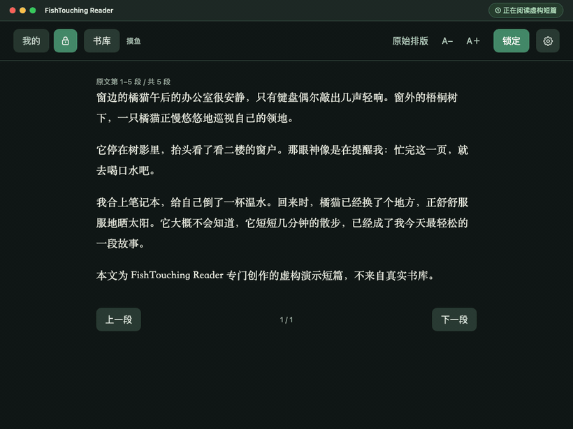
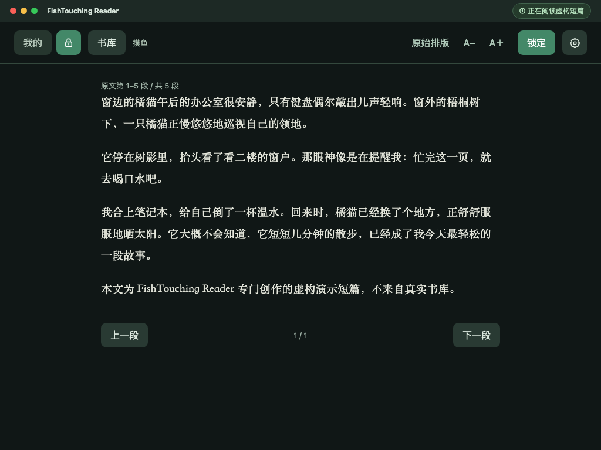
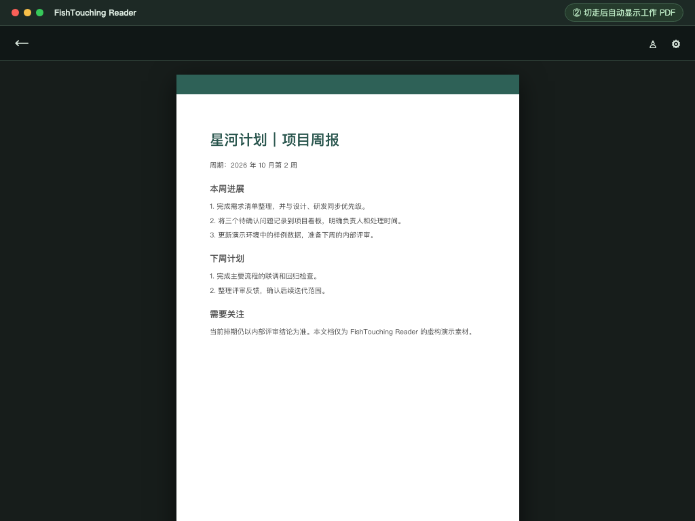
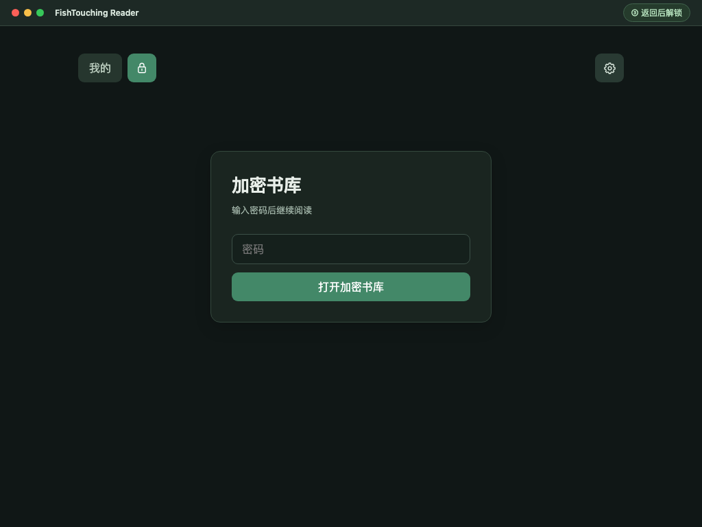
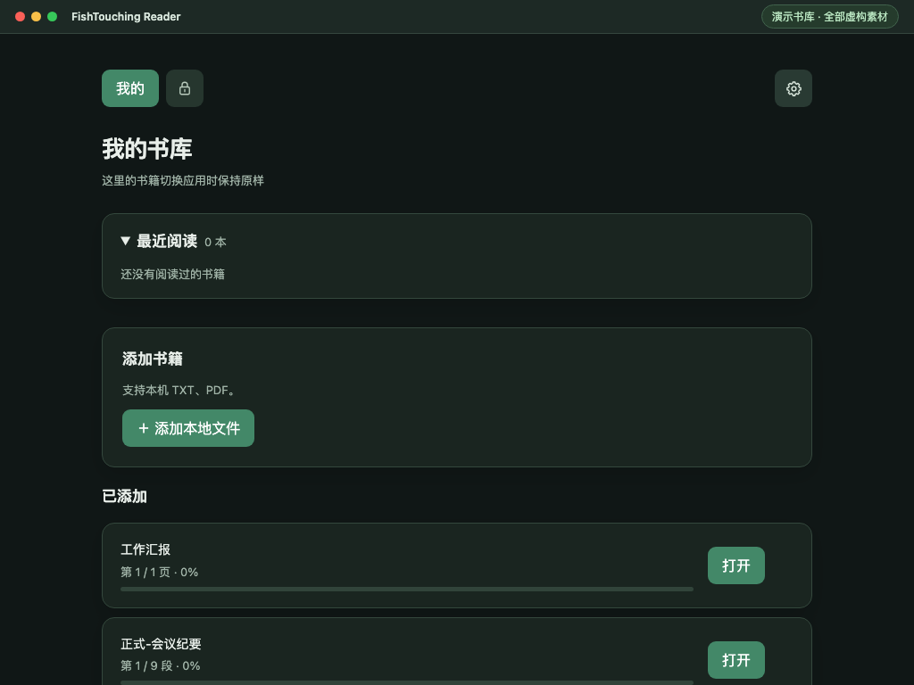

# FishTouching Reader

**还在担心上班摸鱼看小说时，有人突然走过来？** 切到别的应用，还要手忙脚乱地关掉阅读窗口？在 Dock 或 `Command + Tab` 里看到应用名字和图标，就怕别人猜到你在做什么？

FishTouching Reader 是一款 macOS 本地阅读器：把工作文档放进「我的书库」，把想私下阅读的内容放进锁图标后的加密书库。阅读加密内容时，只要应用失去焦点，当前正文就会从窗口移除，并自动打开你准备的工作 PDF。回来后输入密码，可以接着上次的位置读。

**[下载最新版本](https://github.com/YouDiSN/fishtouching-reader/releases/latest)** · [查看所有版本](https://github.com/YouDiSN/fishtouching-reader/releases)



> 演示图使用 [`demo/fixtures`](demo/fixtures) 中专门创作的虚构短篇和工作文档。为保护个人书库，画面是基于实际界面制作的示意素材，没有录制真实书籍或用户数据。

## 切屏时会发生什么？

1. 在「我的书库」导入一份 PDF，比如演示用的 [`工作汇报.pdf`](demo/fixtures/工作汇报.pdf)；在加密书库导入小说 TXT。
2. 正在阅读加密书籍时，切换到其他应用，或让阅读器失去焦点。应用会清除加密正文，切到「我的书库」，并打开**最近导入的普通 PDF**。
3. 回到阅读器，点击锁图标并输入密码，就能回到先前的加密书籍和阅读进度。如果当时看的是「我的书库」中的普通内容，失焦不会触发切换。

| 阅读加密短篇 | 失焦后打开工作 PDF |
| --- | --- |
|  |  |

| 返回后解锁 | 「我的书库」示例 |
| --- | --- |
|  |  |

想试一遍？[`demo/fixtures`](demo/fixtures) 中备好了 `摸鱼.txt`、`正式.txt`、`正式-会议纪要.txt` 和 `工作汇报.pdf`。它们都是演示文件，不包含个人书库内容。

## 名字和图标，也由你决定

首次启动时可以给应用起名、选择图标；之后可随时点右上角齿轮修改。除了 10 个内置图标（默认是摸鱼图标），也可以上传自己的图片。新名称会在重启应用后显示在 Dock、`Command + Tab` 和应用菜单中；图标选择后会立即更新。这样一眼看到应用窗口或切换列表的人，也不会从默认名字和图标直接猜到它是摸鱼阅读器。

自定义图标建议使用至少 **1024 × 1024 像素**的正方形 PNG 原图。删除自定义图标只会移除应用保存的副本，不会删除原始图片。名称留空保存，会恢复默认的 `FishTouching Reader`。应用重命名无需重新编译；设置会在退出后重命名本机 `.app` 文件夹，发行包的名字仍保持默认值。

## 其他功能

- 支持导入本地 TXT、PDF；加密书库中的内容会加密保存。「我的书库」的普通文件不加密。
- 加密书库支持从网址导入，提供单篇预览和目录批量导入。WordPress、Cool18 的已知结构有适配，其他文章页尝试常见正文选择器。分页、动态渲染和特殊模板可能需要额外适配，导入前请在预览中确认正文完整。
- 两个书库都有最近阅读、阅读进度、搜索和按字数排序。列表悬停后可移除书籍；应用会删除自己管理的副本、目录记录与进度，**不会删除 Finder 中最初导入的原始文件**。
- `Control + Option + H` 显示或隐藏窗口，`Command + ,` 打开设置。菜单栏书本图标也提供显示／隐藏与设置入口。

## 下载和安装

从 [GitHub Releases](https://github.com/YouDiSN/fishtouching-reader/releases) 下载当前版本的 macOS 压缩包，解压后将 `FishTouching Reader.app` 拖入“应用程序”文件夹，或放在自己选择的位置运行。当前包是 **Apple Silicon** 架构，目标最低版本为 **macOS 13**；目前只在构建机的 macOS 26.6.2 验证过。构建所用 Homebrew `libsodium` 含有针对 macOS 26 构建的对象文件，旧系统兼容性尚未验证。

下载包为临时签名，尚未经过 Apple 公证。macOS 首次拦截时，可在“系统设置 → 隐私与安全性”中确认打开。请从本仓库 Release 页面下载，并核对 Release 中的 SHA-256。当前没有自动更新功能。

## 构建

需要 macOS、Swift 5.9+、SwiftSoup 包依赖，以及通过 Homebrew 安装的 `libsodium`（构建脚本使用 `/opt/homebrew/lib/libsodium.a`）。

```sh
brew install libsodium
./scripts/build-app.sh
open dist/*.app
```

生成默认名称的发行压缩包：

```sh
./scripts/package-release.sh
```

发行脚本会复制构建结果，并将副本命名为 `FishTouching Reader.app`。本机在设置中修改的名称不会进入下载包。压缩包写入 `release/`，本机 `dist/` 和 `release/` 均不提交到 Git。分发给其他 macOS 版本或架构前，还需要针对目标系统重新构建并签名。

README 演示素材的制作方式见 [`demo/README.md`](demo/README.md)。

## 存储和备份

书库数据保存在 `~/Library/Application Support/LocalLibrary/`，不会随仓库或下载包附带。加密书库的文件名为 UUID；书名、来源网址和内容存放在 AES-GCM 加密文件中，主密钥由用户密码通过 Argon2id（随机 salt、64 MiB 内存、3 次计算）派生的密钥包装。目录中不再保存 `vault.key`。「我的书库」位于 `public-pdfs` 和 `public-texts`，不加密。

旧版迁移前建议备份整个 `LocalLibrary` 目录。**旧版备份仍可能包含原始密钥和带标题的路径**；确认新库、书籍和进度无误后，请自行处理旧备份。密码丢失后无法从新书库恢复加密内容。操作系统交换空间、应用内存和用户自己保留的源文件不在应用存储加密范围内。

## 验证

```sh
.build/release/LocalLibrary --self-test
.build/release/LocalLibrary --verify-live
.build/release/LocalLibrary --verify-migration "/path/to/old/LocalLibrary-backup"
```

迁移验证只使用临时副本，不修改指定备份或正式书库。

## 开源协议

本项目采用 [MIT License](LICENSE)，版权归 `YouDiSN`。你可以修改、分发并用于开源或闭源项目；分发本软件或其重要部分时，须保留原版权和许可声明。SwiftSoup 和 libsodium 各自的许可及版权见 [第三方声明](THIRD_PARTY_NOTICES.md)。下载包内也附有完整声明。
